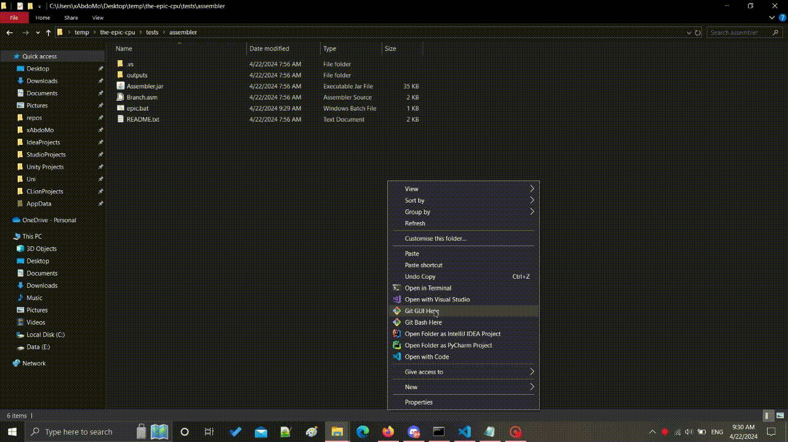

[![Contributors][contributors-shield]][contributors-url]
[![Forks][forks-shield]][forks-url]
[![Stargazers][stars-shield]][stars-url]
[![Issues][issues-shield]][issues-url]
[![MIT License][license-shield]][license-url]

<!-- PROJECT LOGO -->
 

  

  <h3 align="center">The Epic CPU</h3>
  

    a 5-Staged Pipelined processor
     
    <a href="https://github.com/AbdoWise-z/the-epic-cpu/tree/main/cpu"><strong>Explore</strong></a>
     
     
    <a href="https://github.com/AbdoWise-z/the-epic-cpu/tree/main/assembler">Assembler</a>
    ·
    <a href="https://github.com/AbdoWise-z/the-epic-cpu/tree/main/images">Images</a>
    ·
    <a href="https://github.com/AbdoWise-z/the-epic-cpu/issues">Request Feature</a>
  

<!-- TABLE OF CONTENTS -->
## Table of Contents
<ol>
<li>
    <a href="#about-the-project">About The Project</a>
    <ul>
        <li><a href="#built-with">Built With</a></li>
        <li><a href="#features">Features</a></li>
        <li><a href="#isa">ISA</a></li>
    </ul>
</li>
<li>
    <a href="#getting-started">Getting Started</a>
</li>
    <li><a href="#images">Images</a></li>
    <li><a href="#contributing">Contributing</a></li>
    <li><a href="#license">License</a></li>
    <li><a href="#contact">Contact</a></li>
</ol>

<!-- ABOUT THE PROJECT -->
## About The Project

The project was coded as part of our 3rd year study in our university, it consists of two parts
* The CPU: which contains VHDL code for a 5-Staged Pipelined cpu
* The Assembler: which is a java code that generates the Data/Code Segments needed for the CPU to work

 

The CPU is divied into 5 stages as follows:

<ol>
<li> Fetch: fetching next instruction from memory and preparing it for the decode stage
<li> Decode: reading registers values and generating the control signals
<li> Execute: ALU / logic calculations
<li> Memory: modify or retrieve data from memory
<li> Writeback
</ol>

### Built With

The cpu part was built using ModelSim (and VS-Code as a VHDL code editor), while the assembler part was developed using Java on Intelij IDEA

[![VHDL][language-1-shield]][language-1-url]
[![JAVA][language-2-shield]][language-2-url]

(<a href="#readme-top">back to top</a>)

## Features
#### Pipelined processing
the cpu's desgin is based on the 5-staged pipelined processor design (we modified the desgin abit to increase performace)

#### Full-forwarding
the cpu supports ALU-ALU & Memory-ALU forwarding

#### Interrupt / Reset
we added control signals like interrupt and reset to make the cpu interactive with the external world

#### Input / Output ports
input / output ports to transmit and recieve data from external sources

#### ASM Compiler
we desgined an asm compiler to match our ISA, the compiler supports variety of features such as Variables, Memory Jumps, Multiple Code/Data Segments etc..

(<a href="#readme-top">back to top</a>)

## ISA
The CPU Supports 31 different instructions, they are Divied into the following 
* one operand instructions: NOT, NEG, INC, DEC, OUT, IN
* two operand instructions: AND, SUB, AND, OR , XOR, CMP
* immediate instructions  : ADDI, BETSET, RCL, RCR
* memory instructions     : PUSH, POP, LDM, LDD, STD, PROTECT, FREE
* control instructions    : JZ, JMP, CALL, RET, HLT, RTI
* misc                    : NOP, SWAP

The Control Signals can be found [here](https://github.com/AbdoWise-z/the-epic-cpu/blob/main/ISA/ISA.txt)
and each instruction activation is as follows (can also be found [here](https://github.com/AbdoWise-z/the-epic-cpu/blob/main/ISA/control-signals.txt)):
| N  | OP     | FC | RS | Op1S | Op2S | JT | OE | ALU-OP | WB | SPO | PCU | PFR | MR | MW | VS | F | P | Instruction |
|----|--------|----|----|------|------|----|----|--------|----|-----|-----|-----|----|----|----|---|---|-------------|
| 00 | 00000  | 00 | 0  | 00   | 00   | 00 | 0  | 0000   | 0  | 00  | 0   | 0   | 0  | 0  | 00 | 0 | 0 | NOP         |
| 01 | 00001  | 10 | 0  | 00   | 00   | 00 | 0  | 0001   | 1  | 00  | 0   | 0   | 0  | 0  | 00 | 0 | 0 | NOT         |
| 02 | 00010  | 10 | 0  | 00   | 00   | 00 | 0  | 0010   | 1  | 00  | 0   | 0   | 0  | 0  | 00 | 0 | 0 | NEG         |
| 03 | 00011  | 10 | 0  | 00   | 00   | 00 | 0  | 0011   | 1  | 00  | 0   | 0   | 0  | 0  | 00 | 0 | 0 | INC         |
| 04 | 00100  | 10 | 0  | 00   | 00   | 00 | 0  | 0100   | 1  | 00  | 0   | 0   | 0  | 0  | 00 | 0 | 0 | DEC         |
| 05 | 00101  | 10 | 0  | 00   | 00   | 00 | 1  | 0000   | 0  | 00  | 0   | 0   | 0  | 0  | 01 | 0 | 0 | OUT         |
| 06 | 00110  | 00 | 0  | 10   | 00   | 00 | 0  | 0000   | 1  | 00  | 0   | 0   | 0  | 0  | 01 | 0 | 0 | IN          |
| 07 | 00111  | 11 | 1  | 00   | 00   | 00 | 0  | 0101   | 1  | 00  | 0   | 0   | 0  | 0  | 00 | 0 | 0 | ADD         |
| 08 | 01000  | 11 | 1  | 00   | 00   | 00 | 0  | 0110   | 1  | 00  | 0   | 0   | 0  | 0  | 00 | 0 | 0 | SUB         |
| 09 | 01001  | 11 | 1  | 00   | 00   | 00 | 0  | 0111   | 1  | 00  | 0   | 0   | 0  | 0  | 00 | 0 | 0 | AND         |
| 10 | 01010  | 11 | 1  | 00   | 00   | 00 | 0  | 1000   | 1  | 00  | 0   | 0   | 0  | 0  | 00 | 0 | 0 | OR          |
| 11 | 01011  | 11 | 1  | 00   | 00   | 00 | 0  | 1001   | 1  | 00  | 0   | 0   | 0  | 0  | 00 | 0 | 0 | XOR         |
| 12 | 01100  | 11 | 1  | 00   | 00   | 00 | 0  | 1010   | 0  | 00  | 0   | 0   | 0  | 0  | 00 | 0 | 0 | CMP         |
| 13 | 01101  | 10 | 1  | 00   | 01   | 00 | 0  | 0101   | 1  | 00  | 0   | 0   | 0  | 0  | 00 | 0 | 0 | ADDI        |
| 14 | 01110  | 10 | 0  | 00   | 11   | 00 | 0  | 1011   | 1  | 00  | 0   | 0   | 0  | 0  | 00 | 0 | 0 | BITSET      |
| 15 | 01111  | 10 | 0  | 00   | 11   | 00 | 0  | 1100   | 1  | 00  | 0   | 0   | 0  | 0  | 00 | 0 | 0 | RCL         |
| 16 | 10000  | 10 | 0  | 00   | 11   | 00 | 0  | 1101   | 1  | 00  | 0   | 0   | 0  | 0  | 00 | 0 | 0 | RCR         |
| 17 | 10001  | 10 | 0  | 00   | 00   | 00 | 0  | 0000   | 0  | 11  | 0   | 0   | 0  | 1  | 01 | 0 | 0 | PUSH        |
| 18 | 10010  | 00 | 0  | 00   | 00   | 00 | 0  | 0000   | 1  | 10  | 0   | 0   | 1  | 0  | 00 | 0 | 0 | POP         |
| 19 | 10011  | 00 | 0  | 00   | 01   | 00 | 0  | 0000   | 1  | 00  | 0   | 0   | 0  | 0  | 10 | 0 | 0 | LDM         |
| 20 | 10100  | 00 | 0  | 11   | 00   | 00 | 0  | 0000   | 1  | 00  | 0   | 0   | 1  | 0  | 10 | 0 | 0 | LDD         |
| 21 | 10101  | 01 | 0  | 11   | 10   | 00 | 0  | 0000   | 0  | 00  | 0   | 0   | 0  | 1  | 10 | 0 | 0 | STD         |
| 22 | 10110  | 10 | 0  | 00   | 00   | 00 | 0  | 0000   | 0  | 00  | 0   | 0   | 0  | 0  | 00 | 0 | 1 | PROTECT     |
| 23 | 10111  | 10 | 0  | 00   | 00   | 00 | 0  | 0000   | 0  | 00  | 0   | 0   | 0  | 0  | 00 | 1 | 0 | FREE        |
| 24 | 11000  | 10 | 0  | 00   | 00   | 10 | 0  | 1110   | 0  | 00  | 0   | 0   | 0  | 0  | 00 | 0 | 0 | JZ          |
| 25 | 11001  | 10 | 0  | 00   | 00   | 01 | 0  | 0000   | 0  | 00  | 0   | 0   | 0  | 0  | 00 | 0 | 0 | JMP         |
| 26 | 11010  | 01 | 0  | 01   | 00   | 01 | 0  | 0000   | 0  | 11  | 0   | 0   | 0  | 1  | 01 | 0 | 0 | CALL        |
| 27 | 11011  | 00 | 0  | 01   | 00   | 00 | 0  | 0000   | 0  | 11  | 0   | 0   | 0  | 1  | 01 | 0 | 0 | PUSH-PC     |
| 28 | 11100  | 00 | 0  | 00   | 00   | 00 | 0  | 0000   | 0  | 11  | 0   | 0   | 0  | 1  | 11 | 0 | 0 | PUSH-FR (HLT) |
| 29 | 11101  | 00 | 0  | 00   | 00   | 00 | 0  | 0000   | 0  | 10  | 1   | 0   | 1  | 1  | 00 | 0 | 0 | POP-PC (RET) |
| 30 | 11110  | 00 | 0  | 00   | 00   | 00 | 0  | 0000   | 0  | 10  | 0   | 1   | 1  | 1  | 00 | 0 | 0 | POP-FR (RTI) |
| 31 | 11111  | 00 | 0  | 00   | 00   | 00 | 0  | 0000   | 0  | 00  | 0   | 0   | 0  | 0  | 00 | 0 | 0 | SWAP        |

(<a href="#readme-top">back to top</a>)

<!-- GETTING STARTED -->
## Getting Started
you will need to download ModelSim or any VHDL simlator program to simualte the CPU, its source code can be found in /cpu, you will also need to have JAVA 17 to use the compiler

## images

CPU Desgin

 

CPU in modelsim

 

CPU in action

 

Compiler in action

 

<!-- CONTRIBUTING -->
## Contributing

Contributions are what make the open source community such an amazing place to learn, inspire, and create. Any contributions you make are **greatly appreciated**.

This project was developed by
<table>
<tr>

<td align="center">
<a href="https://github.com/AbdoWise-z" target="_black">
 <b>Abdulrahman Mohammed <b>  </a>
</td>

<td align="center">
<a href="https://github.com/Elkapeer" target="_black">
 <b>Osama Saleh</b> </a>
</td>

<td align="center">
<a href="https://github.com/amr-salahuddin" target="_black">
 <b>Amr Salahuddin</b> </a>
</td>

<td align="center">
<a href="https://github.com/Hefney" target="_black">
 <b>Abdulrahman Hefney</b> </a>
</td>

</tr>
 </table>

If you have a suggestion that would make this better, please fork the repo and create a pull request. You can also simply open an issue with the tag "enhancement".
Don't forget to give the project a star! Thanks again!

1. Fork the Project
2. Create your Feature Branch (`git checkout -b feature/AmazingFeature`)
3. Commit your Changes (`git commit -m 'Add some AmazingFeature'`)
4. Push to the Branch (`git push origin feature/AmazingFeature`)
5. Open a Pull Request

(<a href="#readme-top">back to top</a>)

<!-- LICENSE -->
## License

Distributed under the MIT License. See `LICENSE.txt` for more information.

(<a href="#readme-top">back to top</a>)

<!-- CONTACT -->
## Contact

[Abdulrahman Mohammed Abdulfattah](https://www.linkedin.com/in/abdo-mohamed-5b3506252/) - <moh2002.abdow@gmail.com>

(<a href="#readme-top">back to top</a>)

<!--difiniations -->

[contributors-shield]: https://img.shields.io/github/contributors/AbdoWise-z/the-epic-cpu?style=for-the-badge
[contributors-url]: https://github.com/AbdoWise-z/the-epic-cpu/graphs/contributors

[forks-shield]: https://img.shields.io/github/forks/oAbdoWise-z/the-epic-cpu?style=for-the-badge
[forks-url]: https://github.com/AbdoWise-z/the-epic-cpu/network/members

[stars-shield]: https://img.shields.io/github/stars/AbdoWise-z/the-epic-cpu?style=for-the-badge
[stars-url]: https://github.com/AbdoWise-z/the-epic-cpu/stargazers

[issues-shield]: https://img.shields.io/github/issues/AbdoWise-z/the-epic-cpu?style=for-the-badge
[issues-url]: https://github.com/AbdoWise-z/the-epic-cpu/issues

[license-shield]: https://img.shields.io/github/license/AbdoWise-z/the-epic-cpu?style=for-the-badge
[license-url]: https://github.com/AbdoWise-z/the-epic-cpu/blob/master/LICENSE.txt

[language-1-shield]: https://img.shields.io/badge/Language-VHDL-lightgrey?style=for-the-badge
[language-1-url]: https://eda.sw.siemens.com/en-US/ic/modelsim/
[language-2-shield]: https://img.shields.io/badge/Java-ED8B00?style=for-the-badge&logo=openjdk&logoColor=white
[language-2-url]: https://www.java.com/en/
